# 🗳️ MATA RAKSHA

## AI-Enhanced Biometric Blockchain Voting System

<p align="center">


</p>

A secure desktop-based voting system that integrates **biometric fingerprint authentication** with **Ethereum blockchain technology** to provide secure, transparent, and tamper-proof digital elections.

The system enables election administrators to manage the complete election lifecycle—from voter registration and biometric verification to secure vote casting and blockchain-based result generation. It also includes AI analytics modules for election intelligence, which are currently under development for future integration.

---

# 📖 Project Overview

Traditional voting systems often suffer from centralized data storage, voter impersonation, duplicate voting, and limited transparency.

**MATA RAKSHA** addresses these challenges by combining **fingerprint-based biometric authentication**, **role-based election management**, and **Ethereum blockchain technology** into a secure desktop application.

The system authenticates every voter using the **SecuGen Hamster Pro 20 (HU20-AP)** biometric fingerprint scanner before allowing vote casting. Once authenticated, votes are securely recorded as immutable blockchain transactions using Ethereum smart contracts, ensuring election integrity and transparency.

The application follows a **role-based architecture** consisting of three operational modules:

- 👨‍💼 Administrator
- 📝 Registrar
- 🛡️ Election Officer

Each module performs a dedicated responsibility throughout the election lifecycle, from election creation and voter registration to biometric verification, blockchain vote storage, and result computation.

---

# 🎯 Election Workflow

The election process follows a structured workflow to ensure secure voter authentication and transparent election management.

```text
Administrator
        │
        ▼
Create Election
        │
        ▼
Assign Registrar & Election Officer
        │
        ▼
Registrar Registers Voters
        │
        ▼
Capture Fingerprint (SecuGen HU20-AP)
        │
        ▼
Generate Encrypted Biometric Template
        │
        ▼
Store Secure Voter Information
        │
        ▼
Election Officer Verification
        │
        ▼
Fingerprint Authentication
        │
        ▼
Secure Vote Casting
        │
        ▼
Ethereum Blockchain Transaction
        │
        ▼
Immutable Vote Storage
        │
        ▼
Election Result Generation
```

---

# ✨ Key Features

## 🔐 Secure Authentication

- Role-Based Access Control (RBAC)
- Secure Login Authentication
- Fingerprint-Based Voter Verification
- Duplicate Vote Prevention
- Encrypted Biometric Template Storage
- Aadhaar-Based Voter Identification

---

## 👨‍💼 Administrator Module

The Administrator manages the complete election lifecycle.

Features include:

- Registrar Management
- Election Officer Management
- Election Creation
- District-wise Election Configuration
- Candidate Management
- Election Lifecycle Monitoring
- Result Publication

---

## 📝 Registrar Module

The Registrar is responsible for biometric voter enrollment.

Features include:

- Register New Voters
- Aadhaar Verification
- Fingerprint Capture using SecuGen HU20-AP
- Fingerprint Quality Testing
- Secure Biometric Template Storage
- Digital Voter ID Generation
- Update/Delete Voter Records
- District-wise PDF Export
- PNG Voter ID Card Generation

---

## 🛡️ Election Officer Module

The Election Officer manages secure voter verification and vote casting.

Features include:

- Verify Registered Voters
- Fingerprint Authentication
- Secure Voting Window
- Candidate Selection
- Blockchain Vote Submission
- Live Election Status
- Blockchain Connectivity Monitoring
- Turnout Progress Tracking

---

## ⛓️ Blockchain Security

The voting system uses Ethereum blockchain technology to guarantee vote integrity.

Features include:

- Ethereum Smart Contracts
- Immutable Vote Storage
- Tamper-Proof Voting Records
- Transparent Vote Counting
- Blockchain Transaction Verification
- Secure Result Computation

---

## 📊 Election Analytics

The application provides comprehensive election monitoring.

Features include:

- Real-Time Voting Progress
- District-wise Election Status
- Live Turnout Percentage
- Election Lifecycle Management
- Result Generation
- Audit Logs
- Vote History

---

# 🛠️ Technology Stack

| Category | Technology |
|-----------|------------|
| Programming Language | Python 3 |
| Desktop GUI | CustomTkinter |
| Database | SQLite |
| Blockchain | Ethereum |
| Smart Contracts | Solidity |
| Blockchain Network | Ganache |
| Blockchain Integration | Web3.py |
| Biometric Device | SecuGen Hamster Pro 20 (HU20-AP) |
| Fingerprint SDK | SecuGen FDx SDK |
| Security | Cryptographic Hashing |
| AI Libraries *(Under Development)* | OpenCV, NumPy, Scikit-learn |
| Development Environment | Visual Studio Code |

---

# 🚀 Project Highlights

- ✅ Role-Based Election Management
- ✅ Fingerprint Biometric Authentication
- ✅ Ethereum Blockchain Integration
- ✅ Secure Smart Contract Voting
- ✅ District-Wise Election Support
- ✅ Election Lifecycle Management
- ✅ Candidate Management
- ✅ Secure Voter Registration
- ✅ Digital Voter ID Generation
- ✅ Live Voting Progress
- ✅ Blockchain Result Verification
- ✅ Audit Logs & Vote History
- ✅ Modular Desktop Architecture

---

# 🧠 AI Enhancement (Under Development)

To further strengthen election security and analytics, AI modules have been developed and are planned for future integration into the voting workflow.

The planned AI capabilities include:

- 🔍 Fingerprint Quality Assessment
- 📈 Voter Turnout Prediction
- 🚨 Election Anomaly Detection using Isolation Forest
- 📊 Voting Pattern Analysis
- ⚠️ Suspicious Activity Detection

> **Note:** These AI modules are implemented within the project but are currently under development and have not yet been integrated into the primary election workflow.

---

# 🏗️ System Architecture

The MATA RAKSHA system follows a modular architecture that combines biometric authentication, blockchain technology, and secure election management into a unified desktop application.

<p align="center">
    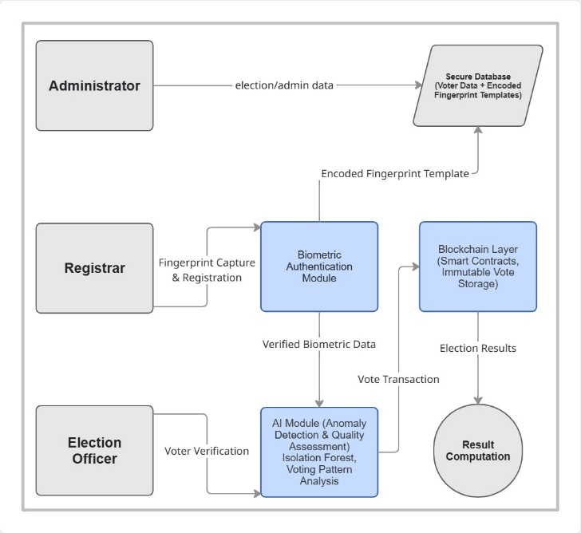
</p>

## Architecture Overview

The system consists of three operational roles:

### 👨‍💼 Administrator

The Administrator is responsible for configuring and managing the complete election lifecycle.

Responsibilities include:

- Create elections
- Assign Registrars
- Assign Election Officers
- Add candidates
- Manage election lifecycle
- Publish results

---

### 📝 Registrar

The Registrar is responsible for voter enrollment.

Responsibilities include:

- Register voters
- Capture fingerprints
- Generate fingerprint templates
- Encrypt biometric information
- Generate voter IDs
- Export reports

---

### 🛡️ Election Officer

The Election Officer is responsible for secure voting.

Responsibilities include:

- Verify voter identity
- Authenticate fingerprints
- Allow secure vote casting
- Monitor election status
- View live turnout

---

### 🔐 Biometric Authentication Module

The biometric module performs secure voter authentication using the **SecuGen Hamster Pro 20 (HU20-AP)** fingerprint scanner.

Functions include:

- Fingerprint capture
- Template generation
- Secure template storage
- Template matching
- Authentication before voting

---

### ⛓️ Blockchain Layer

Every successfully verified vote is recorded as an Ethereum blockchain transaction.

The blockchain layer provides:

- Immutable vote storage
- Smart contract execution
- Transparent vote counting
- Tamper-proof records

---

### 💾 Secure Database

The SQLite database securely stores:

- Election information
- Candidate information
- Registrar details
- Election Officer details
- Voter details
- Encrypted fingerprint templates

---

### 📊 Result Computation

After voting concludes, blockchain transactions are processed to generate transparent election results.

The result module provides:

- Vote counting
- Candidate-wise results
- Election statistics
- Final election reports

---

# 🔄 System Workflow

The complete election workflow is illustrated below.

<p align="center">
    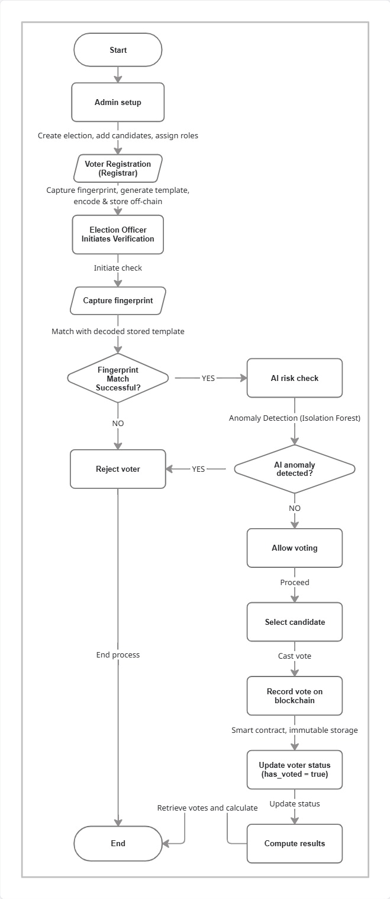
</p>

## Workflow Explanation

### Step 1 – Election Setup

The Administrator creates a new election, defines its duration, registers candidates, and assigns Registrars and Election Officers for each district.

---

### Step 2 – Voter Registration

The Registrar registers eligible voters by entering personal details and capturing fingerprints using the SecuGen biometric scanner.

The captured fingerprint is converted into an encrypted biometric template and securely stored in the database.

---

### Step 3 – Voter Verification

During voting, the Election Officer initiates voter verification.

The voter's fingerprint is captured and matched against the stored biometric template.

Only authenticated voters proceed to the next step.

---

### Step 4 – AI Risk Assessment *(Under Development)*

The project includes AI modules designed to enhance election security.

Planned capabilities include:

- Fingerprint Quality Assessment
- Election Anomaly Detection
- Voting Pattern Analysis
- Voter Turnout Prediction

These modules are currently under development and will be integrated into future versions.

---

### Step 5 – Secure Vote Casting

After successful authentication, the voter is presented with the candidate list and securely casts a vote.

The Election Officer cannot alter or influence the voting process.

---

### Step 6 – Blockchain Recording

Each vote is submitted to an Ethereum smart contract.

The blockchain guarantees:

- Immutable vote records
- Tamper-proof transactions
- Transparent verification

---

### Step 7 – Election Finalization

Once the election ends, the Administrator finalizes the election.

The blockchain records are used to calculate the final result.

---

### Step 8 – Result Generation

The system computes:

- Candidate-wise vote count
- District-wise results
- Overall election statistics
- Live turnout percentage
- Blockchain-verified final result

---

# 🖥️ Application Modules

The MATA RAKSHA application follows a role-based architecture consisting of three operational modules: **Administrator**, **Registrar**, and **Election Officer**. Each module performs a dedicated responsibility in the election lifecycle, ensuring secure and transparent election management.

---

# 🔐 Login Module

The Login Module serves as the secure entry point of the application. Users authenticate themselves by selecting their role and entering valid credentials before accessing their respective dashboard.

<p align="center">
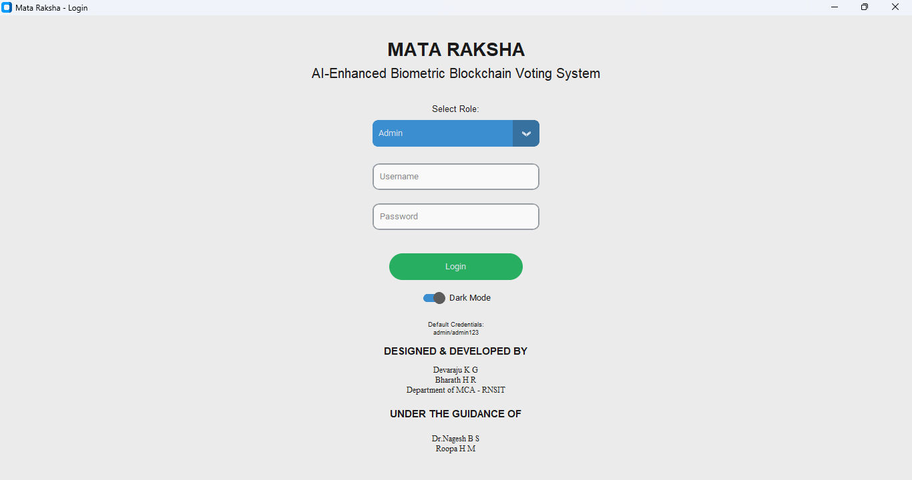
</p>

### Features

- Role-Based Login
- Secure Authentication
- Dark Mode Support
- Administrator Login
- Registrar Login
- Election Officer Login

---

# 👨‍💼 Administrator Dashboard

The Administrator controls the complete election lifecycle through five dedicated management modules.

---

## 1️⃣ Registrar Management

The Administrator can create, update, and remove Registrars assigned to different districts.

<p align="center">
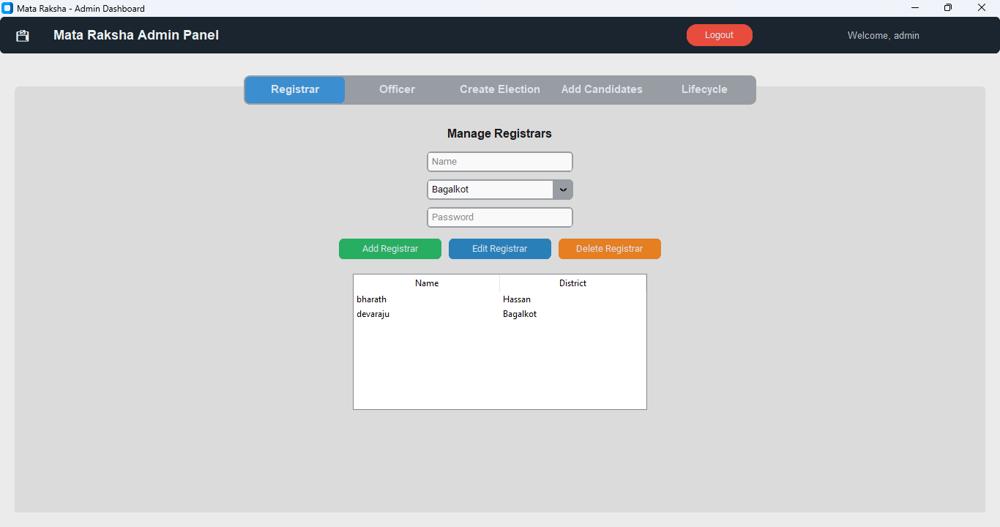
</p>

### Functionalities

- Add Registrar
- Update Registrar
- Delete Registrar
- District Assignment
- Secure Credential Management

---

## 2️⃣ Election Officer Management

Election Officers responsible for conducting elections are managed from this module.

<p align="center">
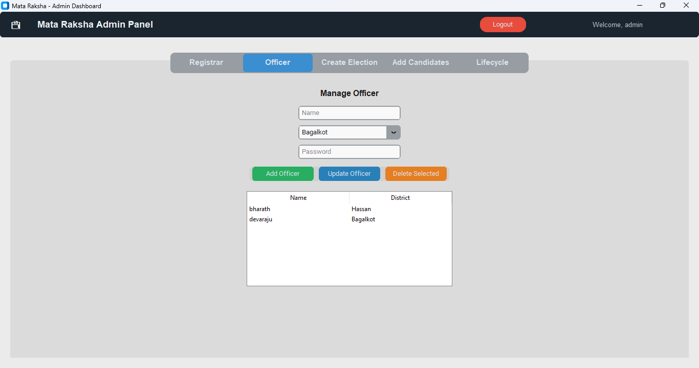
</p>

### Functionalities

- Create Officer
- Update Officer
- Delete Officer
- District-wise Assignment

---

## 3️⃣ Election Creation

The Administrator creates elections by specifying the election name, start date, and end date.

The system automatically creates district-wise elections for all Karnataka districts.

<p align="center">
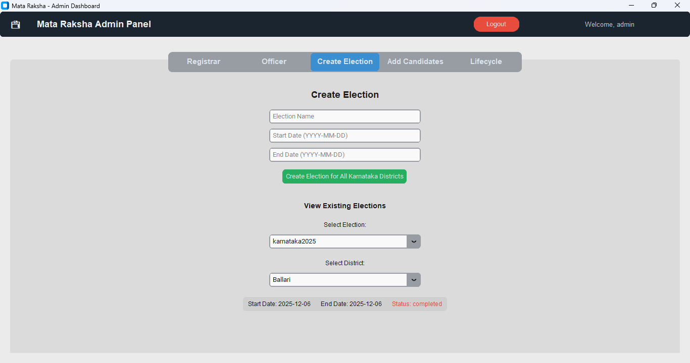
</p>

### Functionalities

- Create Election
- Start & End Date Configuration
- Karnataka District Generation
- View Existing Elections
- Election Status Monitoring

---

## 4️⃣ Candidate Management

Candidates participating in elections are managed through this module.

<p align="center">
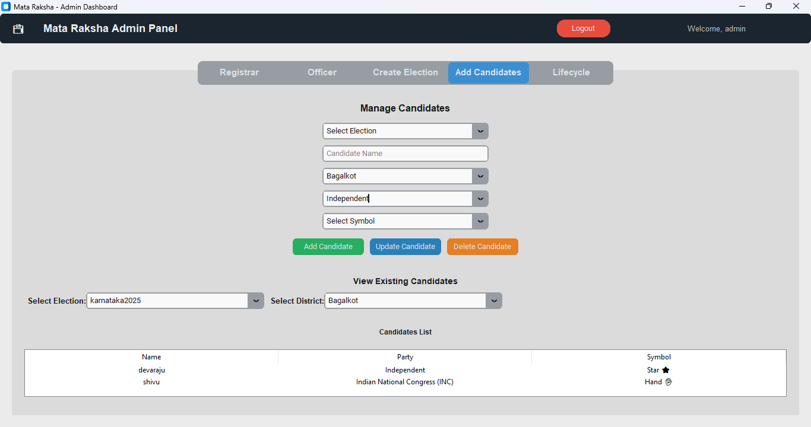
</p>

### Functionalities

- Add Candidate
- Update Candidate
- Delete Candidate
- Political Party Selection
- Election Symbol Selection
- District-wise Candidate Management

---

## 5️⃣ Election Lifecycle Management

This module monitors the complete progress of an election from initiation to completion.

<p align="center">
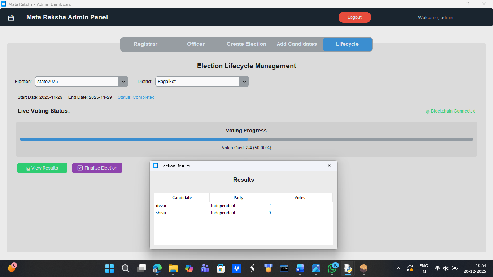
</p>

### Functionalities

- Live Voting Progress
- Blockchain Connection Status
- Election Finalization
- View Election Results
- Turnout Monitoring

---

# 📝 Registrar Dashboard

The Registrar is responsible for voter enrollment and biometric registration.

---

## 1️⃣ Register Voter

Eligible voters are registered by entering their demographic information and capturing fingerprints using the SecuGen biometric scanner.

<p align="center">
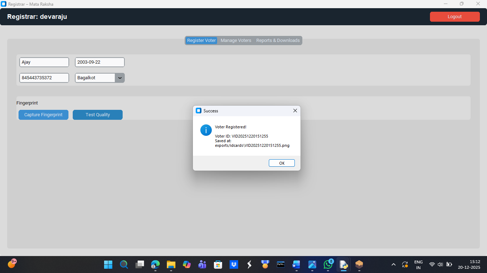
</p>

### Functionalities

- Aadhaar Entry
- Personal Information Registration
- Fingerprint Capture
- Fingerprint Quality Test
- Biometric Template Generation
- Secure Voter Registration
- Digital Voter ID Generation

---

## 2️⃣ Manage Voters

Existing voter records can be searched, updated, verified, or removed.

<p align="center">
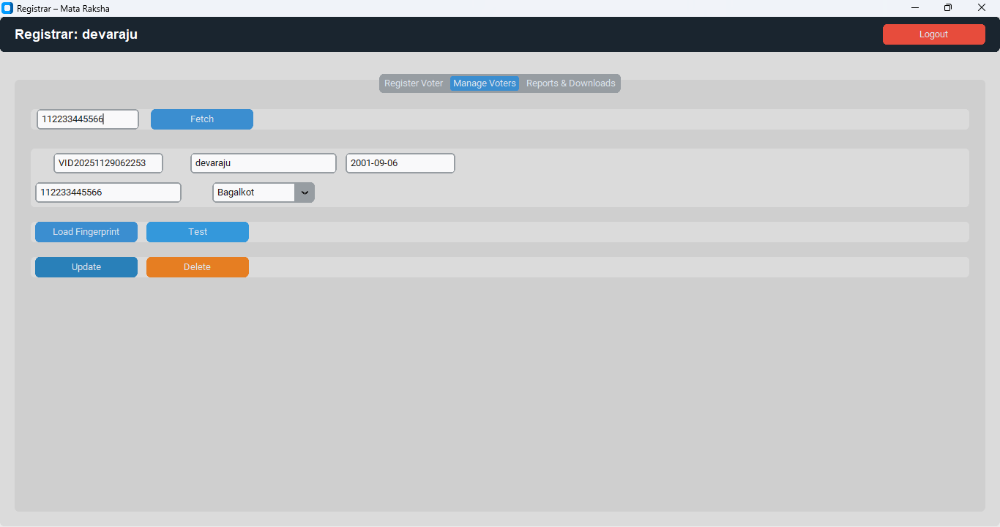
</p>

### Functionalities

- Search by Aadhaar
- Load Stored Fingerprint
- Verify Fingerprint
- Update Details
- Delete Records

---

## 3️⃣ Reports & Downloads

Administrative reports and voter identification cards are generated from this module.

<p align="center">
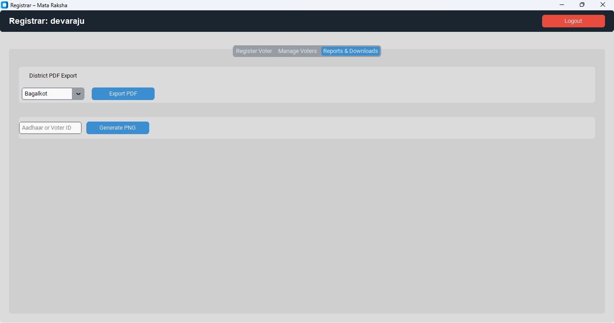
</p>

### Functionalities

- District-wise PDF Export
- PNG Voter ID Card Generation
- Report Download

---

# 🛡️ Election Officer Dashboard

The Election Officer conducts secure voter verification and vote casting.

---

## 1️⃣ Voter Verification & Secure Voting

The officer verifies voter identity before opening the secure voting interface.

<p align="center">
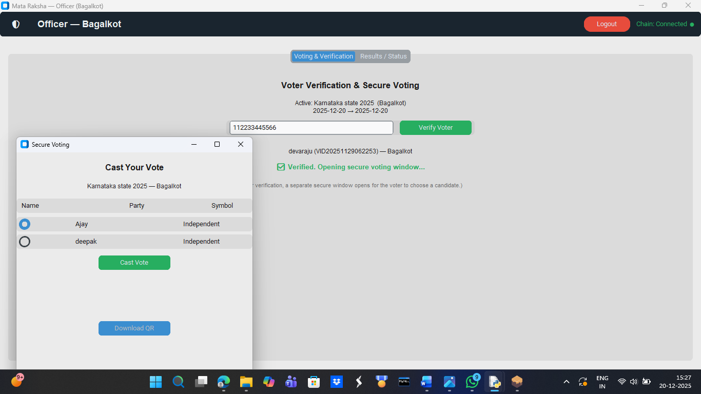
</p>

### Functionalities

- Aadhaar Verification
- Fingerprint Authentication
- Secure Voting Window
- Candidate Selection
- Blockchain Vote Casting
- QR Code Generation

---

## 2️⃣ Live Results & Election Status

The Election Officer monitors the current election status and turnout while maintaining blockchain connectivity.

<p align="center">
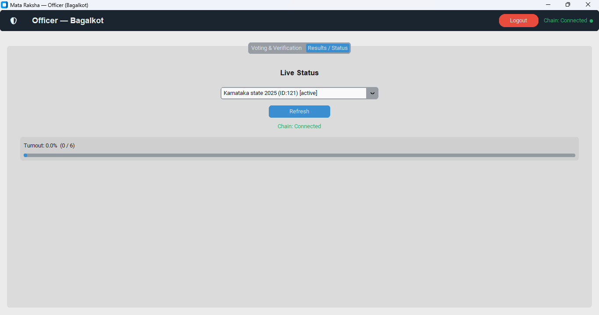
</p>

### Functionalities

- Live Election Status
- Turnout Percentage
- Blockchain Connection Status
- Election Progress Monitoring

---

# 🔄 End-to-End Election Process

The application follows the workflow below:

```text
Administrator
      │
      ▼
Create Election
      │
      ▼
Assign Registrar & Election Officer
      │
      ▼
Registrar Registers Voters
      │
      ▼
Capture Fingerprint
      │
      ▼
Generate Fingerprint Template
      │
      ▼
Store Encrypted Template
      │
      ▼
Election Officer Verification
      │
      ▼
Authenticate Fingerprint
      │
      ▼
Secure Vote Casting
      │
      ▼
Ethereum Smart Contract
      │
      ▼
Blockchain Transaction
      │
      ▼
Election Result Generation
```

---
---

# 📂 Project Structure

The project follows a modular architecture to improve maintainability, scalability, and code organization.

```text
MATA-RAKSHA
│
├── assets/                     # Project assets
│   └── contracts/
│       └── VotingContract.sol
│
├── database/                   # SQLite database
│
├── docs/
│   ├── architecture.png
│   ├── workflow.png
│   └── screenshots/
│
├── src/
│   ├── ai/                     # AI modules (Under Development)
│   │   ├── ai_anomaly.py
│   │   ├── ai_fingerprint.py
│   │   └── ai_turnout.py
│   │
│   ├── gui/
│   │   ├── login_window.py
│   │   ├── admin_dashboard.py
│   │   ├── registrar_dashboard.py
│   │   └── officer_dashboard.py
│   │
│   └── utils/
│       ├── biometric.py
│       ├── biometric_secugen.py
│       ├── blockchain.py
│       ├── database.py
│       ├── ctk_datepicker.py
│       └── dll/
│
├── main.py
├── contract_abi.json
├── requirements.txt
├── README.md
└── LICENSE
```

---

# ⚙️ Installation

## Prerequisites

Before running the application, install the following software.

### Python

- Python 3.10 or later

### Blockchain

- Ganache (Local Ethereum Blockchain)

### Fingerprint Scanner

- SecuGen Hamster Pro 20 (HU20-AP)

### Development Tools

- Visual Studio Code
- Git

---

# 📦 Install Required Packages

Clone the repository.

```bash
git clone https://github.com/devarajukgmca021/MATA-RAKSHA.git
```

Open the project.

```bash
cd MATA-RAKSHA
```

Install dependencies.

```bash
pip install -r requirements.txt
```

---

# ▶️ Running the Application

## Step 1

Start Ganache.

Ensure Ganache is running on:

```
http://127.0.0.1:8545
```

---

## Step 2

Connect the SecuGen fingerprint scanner.

---

## Step 3

Run the application.

```bash
python main.py
```

---

# 🔒 Security Features

The system incorporates multiple layers of security to ensure election integrity.

### Authentication

- Role-Based Access Control
- Secure Login Authentication
- Administrator Authorization

---

### Biometric Security

- Fingerprint Enrollment
- Fingerprint Verification
- Encrypted Fingerprint Template Storage
- Secure Template Matching

---

### Blockchain Security

- Ethereum Smart Contracts
- Immutable Vote Storage
- Tamper-Proof Records
- Blockchain Transaction Verification

---

### Election Security

- Duplicate Vote Prevention
- District-wise Election Validation
- Secure Vote Casting
- Transparent Result Generation

---

### Database Security

- SQLite Storage
- Cryptographic Hashing
- Secure Data Management

---

# 📊 Current Project Status

| Module | Status |
|---------|:------:|
| Login System | ✅ Completed |
| Administrator Module | ✅ Completed |
| Registrar Module | ✅ Completed |
| Election Officer Module | ✅ Completed |
| Fingerprint Authentication | ✅ Completed |
| Blockchain Integration | ✅ Completed |
| Smart Contract Voting | ✅ Completed |
| Election Lifecycle | ✅ Completed |
| Reports & Downloads | ✅ Completed |
| AI Analytics | 🚧 Under Development |

---

# 🚀 Future Enhancements

The following features are planned for future releases.

## Artificial Intelligence

- Fingerprint Quality Assessment
- Election Anomaly Detection
- Voter Turnout Prediction
- Suspicious Voting Pattern Analysis

---

## Security

- Zero Knowledge Proof (ZKP)
- Multi-Factor Authentication
- Advanced Cryptographic Verification

---

## Blockchain

- Ethereum Testnet Deployment
- Public Blockchain Support
- Decentralized Identity (DID)

---

## Platform

- Web Application
- Android Application
- Cloud Deployment
- Online Remote Voting

---

# 👨‍💻 Author

**Devaraju K G**

Master of Computer Applications (MCA)

RNS Institute of Technology

Bengaluru, Karnataka, India

GitHub:
https://github.com/devarajukgmca021

---

# 🙏 Acknowledgements

The author sincerely thanks the faculty members of the Department of Master of Computer Applications, RNS Institute of Technology, for their continuous guidance and encouragement throughout the development of this project.

Special thanks to Dr. Nagesh B S for providing valuable technical guidance and project supervision.

---

# 📜 License

This project is licensed under the **MIT License**.

See the **LICENSE** file for complete details.

---

# ⭐ Support

If you found this project useful, consider giving it a ⭐ on GitHub.

Your support encourages further improvements and future enhancements.

---
